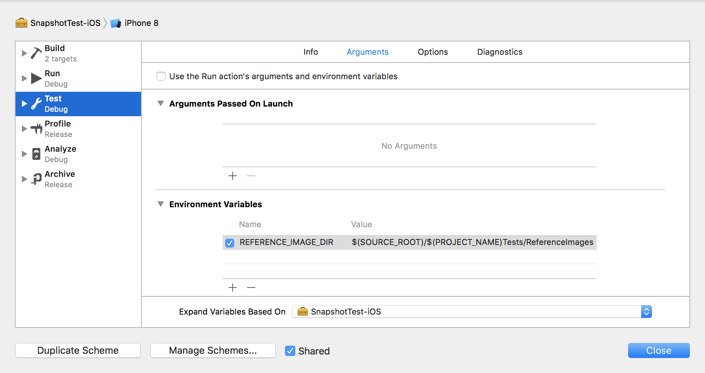

<p align="center">
	
</p>

<p align="center">
	<a href="https://travis-ci.org/parski/SnapshotTest"></a>
</p>

**SnapshotTest** is a simple view testing tool written completely in Swift to aid with development for Apple platforms. It's like unit testing for views.

### How
When **record mode** is active a snapshot assertion will record an image of the view and save it to a **specified directory**. This will cause the test to fail. When record mode is deactivated the snapshot assertion will record an image of the view and compare it to the saved reference image. Should they differ the test will fail.

### Setup
All SnapshotTest needs to know is where to save the reference images. This directory is specified using a test scheme environmental variable using the key: 

```
REFERENCE_IMAGE_DIR
```

Recommended reference image directory path is: 

```
$(SOURCE_ROOT)/$(PROJECT_NAME)Tests/ReferenceImages
```
It should look something like this:



### Usage
If you are familiar with **XCTest** using **SnapshotTest** will be a breeze. Instead of subclassing **XCTestCase** you just need to subclass **SnapshotTestCase** and assert the view to test it.

```swift
class ViewTests: SnapshotTestCase {
    
    func testView_withAlteration() {
        // Given
        let view = View(frame: CGRect(x: 0, y: 0, width: 375, height: 100))
        
        // When
        view.alter()
        
        // Then
        AssertSnapshot(view)
    }
    
}
```

### Record mode
To set the test case to record mode simply change the `recordMode` property to true.

```swift
class ViewTests: SnapshotTestCase {
    
    override func setUp() {
        super.setUp()
	recordMode = true
    }
    
}
```

The assertion will then record and save a reference image.

### Options
SnapshotTest provides different ways to compare snapshots using several options.
  
| Option    | Description                                          |
|-----------|------------------------------------------------------|
| device    | Compares snapshots specific to a certain device.     |
| osVersion | Compares snapshots specific to a certain OS version. |

To use one or several options you just pass them to the options argument of the assertion:

```swift
AssertSnapshot(view, options: [.device, .osVersion])
```

### Platforms
The following platforms and minimum versions are supported:

* iOS 8.0
* tvOS 8.0

### Distribution
Use SnapshotTest by building it and integrating it into your project manually or by using a depencency manager. Currently only CocoaPods is supported with more to come.

#### CocoaPods
Just add the following line to your Podfile in the scope of your **test target**:

```ruby
target "MyAppTests" do
  use_frameworks!
  pod 'SnapshotTest' ~> 'X.Y.Z'
end
```
Replace `X.Y.Z` with the starting version you wish to use. Breaking backward compatability will be a last resort kind of deal but specifying version is still recommended.

### Contribute
SnapshotTest is licensed under the **BSD 2-clause License** and contributions are very welcome in the form of pull requests and issues.
